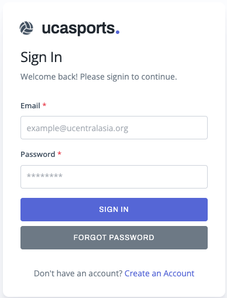
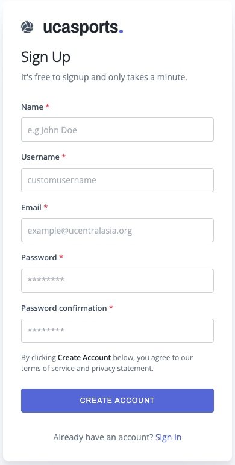
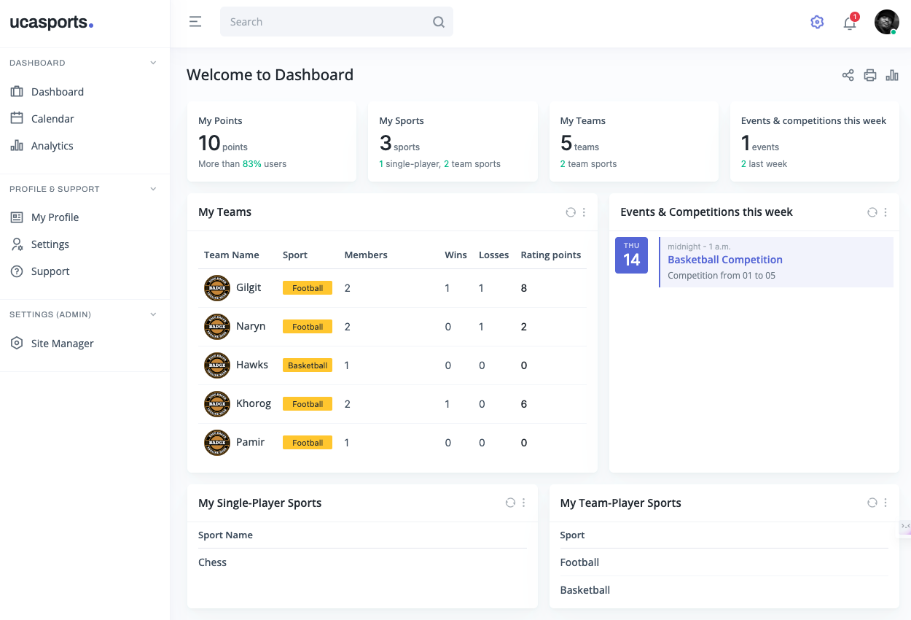
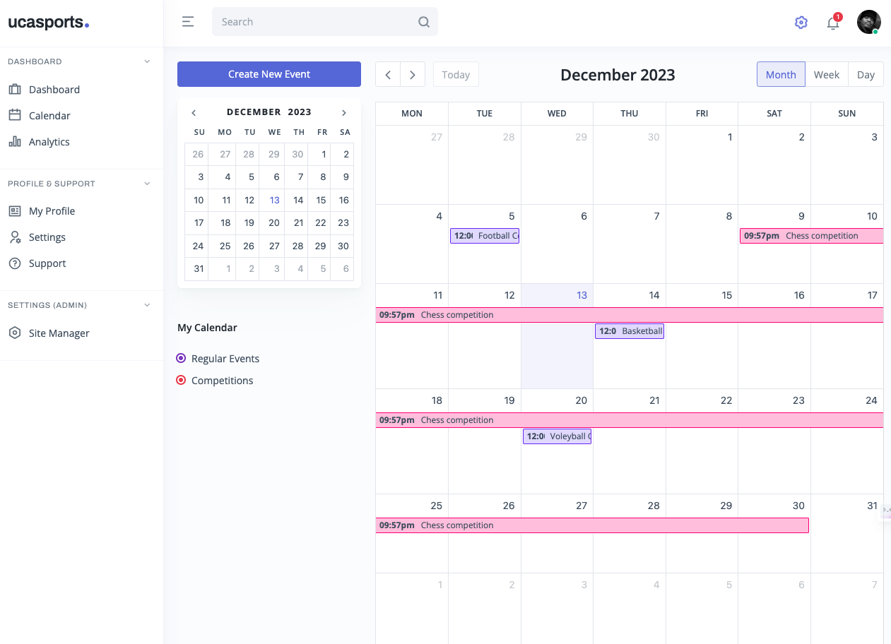
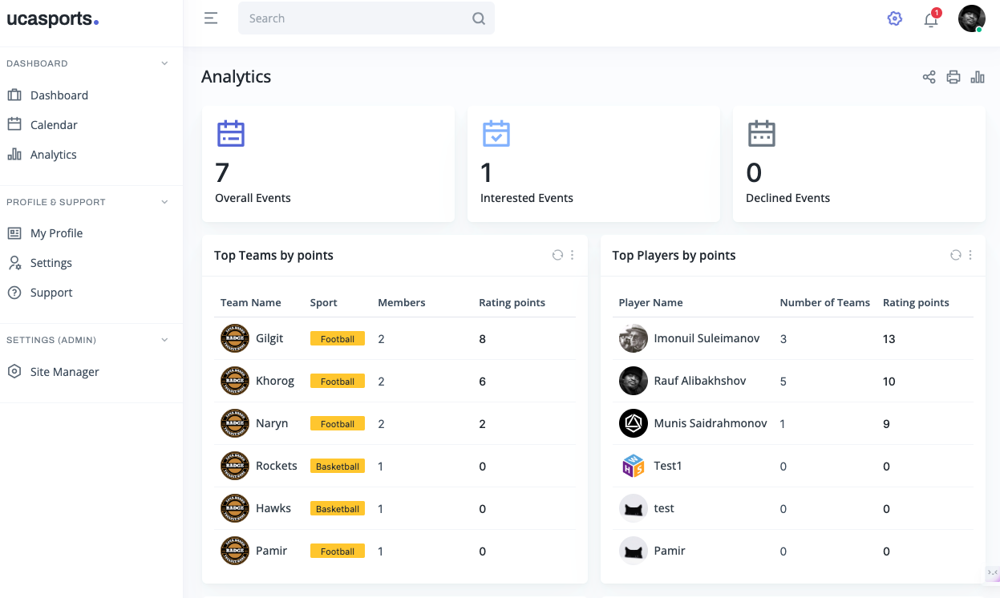
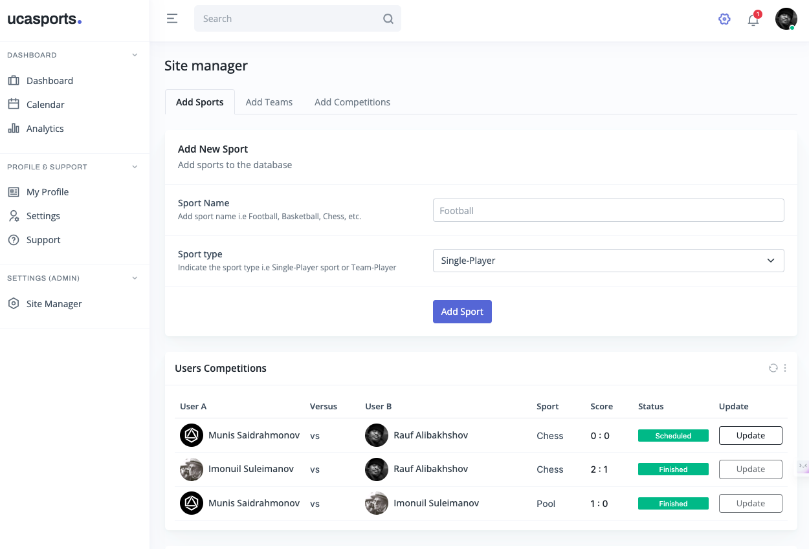
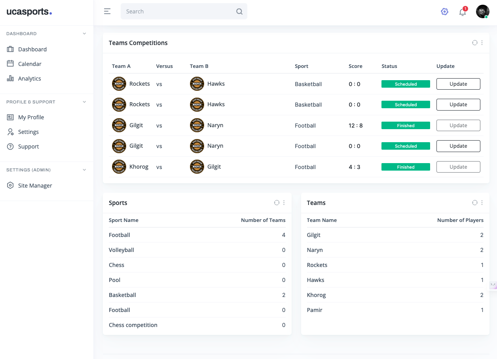

# Sport Management System

## Table of Contents
- [Overview](#overview)
- [Features](#features)
- [Installation](#installation)
  - [Prerequisites](#prerequisites)
  - [Steps](#steps)
- [Screenshots](#screenshots)
- [Contributing](#contributing)
- [License](#license)

## Overview

The Sport Management System is a web application built with Django, designed to streamline and simplify the management of sports-related activities. It provides a comprehensive platform for managing teams, players, fixtures, and other essential aspects of sports administration.

## Features

- **User Authentication:** Secure user authentication system to ensure that only authorized users can access and modify data.

- **Team Management:** Create, update, and delete teams. Assign players to teams and manage team details.

- **Player Management:** Maintain a database of players, including personal information, skill levels, and performance statistics.

- **Fixture Management:** Schedule and manage fixtures for different sports, including date, time, and venue details.

- **Results Tracking:** Record and display match results, allowing users to keep track of team performances.

- **Statistics and Analytics:** Generate and view statistical insights, such as player performance metrics, team standings, and more.

- **Admin Dashboard:** An intuitive admin dashboard for administrators to manage users, teams, and overall system settings.

## Installation

### Prerequisites

- Python 3.x
- Django 3.x
- Django REST Framework 3.x
- Pillow 8.x

### Steps

1. Clone the repository:

    ```bash
    https://github.com/Alibakhshov/UCA-Sport-Management-System.git
    cd sport-management-system
    ```

2. Create a virtual environment:

    ```bash
    python -m venv venv
    ```

3. Activate the virtual environment:

    - On Windows:

        ```bash
        venv\Scripts\activate
        ```

    - On Unix or MacOS:

        ```bash
        source venv/bin/activate
        ```

4. Install dependencies:

    ```bash
    pip install -r requirements.txt
    ```

5. Apply database migrations:

    ```bash
    python manage.py migrate
    ```

6. Run the development server:

    ```bash
    python manage.py runserver
    ```

7. Open your browser and navigate to [http://localhost:8000](http://localhost:8000) to access the Sport Management System.

## Screenshots

Include screenshots here to showcase the user interface and features of your Sport Management System. 



  












<!-- Add more screenshots as needed -->

## Contributing

If you'd like to contribute to the project, please follow the guidelines in [CONTRIBUTING.md](CONTRIBUTING.md).

## License

This project is licensed under the MIT License - see the [LICENSE](LICENSE) file for details.
"# management-sport-system" 
